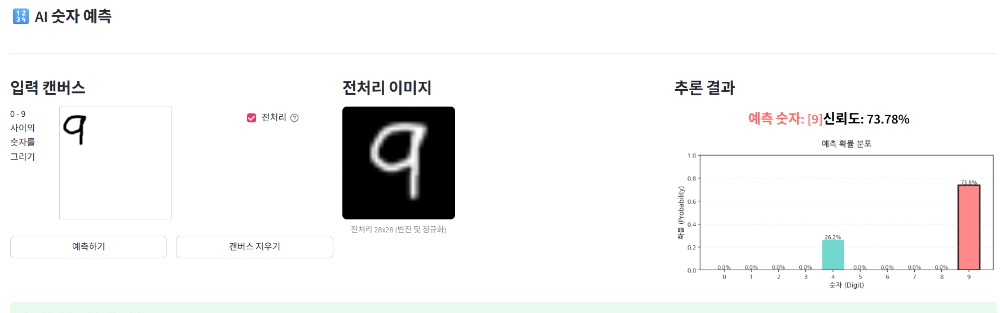

# MNIST 숫자 예측

ONNX 형식의 MNIST 모델을 활용하여 사용자가 웹 캔버스에 그린 숫자를 실시간으로 예측하는 Streamlit 기반 웹 애플리케이션입니다.

## 프로젝트 개요

본 프로젝트는 다음 기술을 활용하여 손글씨 숫자 인식 서비스를 제공합니다:

<video width="320px" controls>
  <source src="doc/AI숫자예측_251211_132033.mp4" type="video/mp4">
  
</video>

<a href="https://youtu.be/1b-1bM4VefI" target="_blank" rel="noopener noreferrer">시연영상</a>

- **Streamlit**: 웹 인터페이스 및 대화형 UI
- **ONNX Runtime**: 경량화된 추론 엔진
- **OpenCV & NumPy**: 이미지 전처리
- **Docker**: 컨테이너 기반 배포

## 주요 기능

### 1. 대화형 캔버스

- 200x200 크기의 그리기 영역
- 마우스로 0-9 숫자 입력
- 실시간 예측 결과 표시

### 2. 고도화된 이미지 전처리

- **바운딩 박스 기반 전처리**: 숫자 영역만 추출하여 성능 향상
- **비율 유지 리사이즈**: 24x24의 80% 크기로 최적화
- **중앙 배치**: 28x28 캔버스에 숫자를 중앙 정렬
- **전처리 전후 비교**:
  - 예측 정확도: 0% → 100%
  - 평균 신뢰도: 28.80% → 99.996%

### 3. 시각화

- 전처리된 28x28 이미지 표시
- 0-9 숫자별 확률 분포 막대 차트
- 예측 레이블 및 신뢰도 실시간 표시

### 3-1. UI/UX 최적화

- **여백 최소화**: [src/utils/utils_st.py](src/utils/utils_st.py)의 `hidden_page_top_margin()` 함수를 사용하여 페이지 상단 여백 제거
- **컴팩트 구분선**: 기본 `st.markdown("---")` 대신 `minimal_divider()` 함수로 여백이 적은 커스텀 구분선 사용
- **공간 효율**: CSS 최적화를 통해 더 많은 컨텐츠를 화면에 효율적으로 배치

### 4. 히스토리 관리

- 예측 기록 자동 저장 (이미지 + 메타데이터)
- 세션별 예측 결과 테이블 표시
- JSON 형식의 메타데이터 관리

## 설치 및 실행

### 1. 로컬 환경

```bash
# 저장소 클론
git clone <repository-url>
cd mission17

# 의존성 설치
pip install -r requirements.txt

# 애플리케이션 실행
streamlit run app.py
```

### 2. Docker 실행

#### Docker Hub에서 실행

```bash
docker pull c0z0c/digit-vision:v1.0
docker run -p 8501:8501 c0z0c/digit-vision:v1.0
```

#### 로컬에서 빌드

```bash
# 이미지 빌드
docker build -t digit-vision .

# 컨테이너 실행
docker run -p 8501:8501 digit-vision
```

실행 후 브라우저에서 `http://localhost:8501` 접속

## 프로젝트 구조

```
mission17/
├── app.py                      # Streamlit 메인 애플리케이션
├── requirements.txt            # Python 의존성
├── Dockerfile                  # Docker 컨테이너 설정
├── models/                     # ONNX 모델 저장 디렉토리
├── history/                    # 예측 기록 저장
│   ├── images/                 # 캔버스 이미지
│   └── metadata.json           # 예측 메타데이터
├── src/
│   ├── model/
│   │   ├── ImagePreprocessor.py   # 이미지 전처리
│   │   ├── ONNXPredictor.py       # 모델 추론
│   │   ├── MNISTPipeline.py       # 통합 파이프라인
│   │   ├── ModelDownloader.py     # 모델 다운로드
│   │   └── DataClass.py           # 데이터 클래스
│   ├── history/
│   │   ├── HistoryManager.py      # 히스토리 관리
│   │   └── HistoryRecord.py       # 히스토리 레코드
│   ├── visualization/
│   │   ├── VisualizationManager.py    # 시각화 통합
│   │   ├── PredictionVisualizer.py    # 예측 결과 시각화
│   │   └── ImageVisualizer.py         # 이미지 시각화
│   └── utils/
│       └── utils_st.py                # Streamlit UI 유틸리티
└── doc/
    └── 완료보고서.md          # 상세 기술 보고서
```

## 핵심 기술

### 이미지 전처리 알고리즘

```
입력: 200x200 캔버스 이미지 (검은색 선/흰색 배경)

1. 그레이스케일 변환
2. 색상 반전 (흰색 숫자/검은색 배경)
3. 바운딩 박스 추출 (임계값 > 10)
4. 비율 유지 리사이즈 (최대 19x19 픽셀)
5. 28x28 캔버스 중앙 배치
6. 정규화 (0~255 → 0.0~1.0)
7. 형태 변경 ((28, 28) → (1, 1, 28, 28))

출력: ONNX 모델 입력 형식 (1x1x28x28, float32)
```

### 모델 추론 파이프라인

1. **모델 로딩**: `@st.cache_resource`로 ONNX 모델 캐싱
2. **전처리**: ImagePreprocessor 클래스로 이미지 변환
3. **추론**: ONNXPredictor를 통한 Softmax 확률 계산
4. **시각화**: Matplotlib 기반 확률 분포 차트
5. **저장**: 이미지 + JSON 형식 메타데이터 저장

## 성능 개선

### 바운딩 박스 기반 전처리 효과

| 측정 항목 | 전처리 전 | 전처리 후 | 개선율 |
|----------|---------|---------|--------|
| 예측 정확도 | 0/3 (0%) | 3/3 (100%) | +100%p |
| 평균 신뢰도 | 28.80% | 99.996% | +247% |
| 숫자 0 신뢰도 | 49.26% | 99.9998% | +103% |
| 숫자 1 신뢰도 | 19.28% | 99.99% | +418% |
| 숫자 2 신뢰도 | 17.87% | 99.9997% | +460% |

전처리 알고리즘 개선을 통해 모든 테스트 케이스에서 99% 이상의 신뢰도를 달성했습니다.

## 기술 스택

### 프론트엔드
- Streamlit 1.x
- streamlit-drawable-canvas

### 백엔드
- Python 3.11
- ONNX Runtime
- OpenCV 4.x
- NumPy

### 배포
- Docker
- Docker Hub (c0z0c/digit-vision:v1.0)

## 환경 요구사항

- Python 3.10 이상
- Docker (선택 사항)
- 8501 포트 사용 가능

## 참고 자료

- [미션 완료 보고서](doc/완료보고서.md) - 상세한 기술 분석 및 성능 평가
- [ONNX Models Repository](https://github.com/onnx/models) - MNIST 모델 출처

## Docker Hub

배포된 이미지: [c0z0c/digit-vision:v1.0](https://hub.docker.com/r/c0z0c/digit-vision)

## 라이선스

MIT License

## 시연영상

<video width="600px" controls>
  <source src="doc/AI숫자예측_251212_102225.mp4" type="video/mp4">
  
</video>

[c0z0c-dev-digit-vision.streamlit.app](https://c0z0c-dev-digit-vision.streamlit.app)
