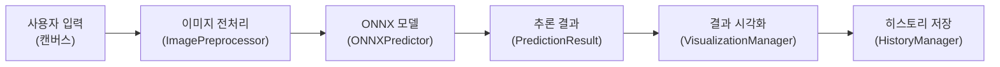
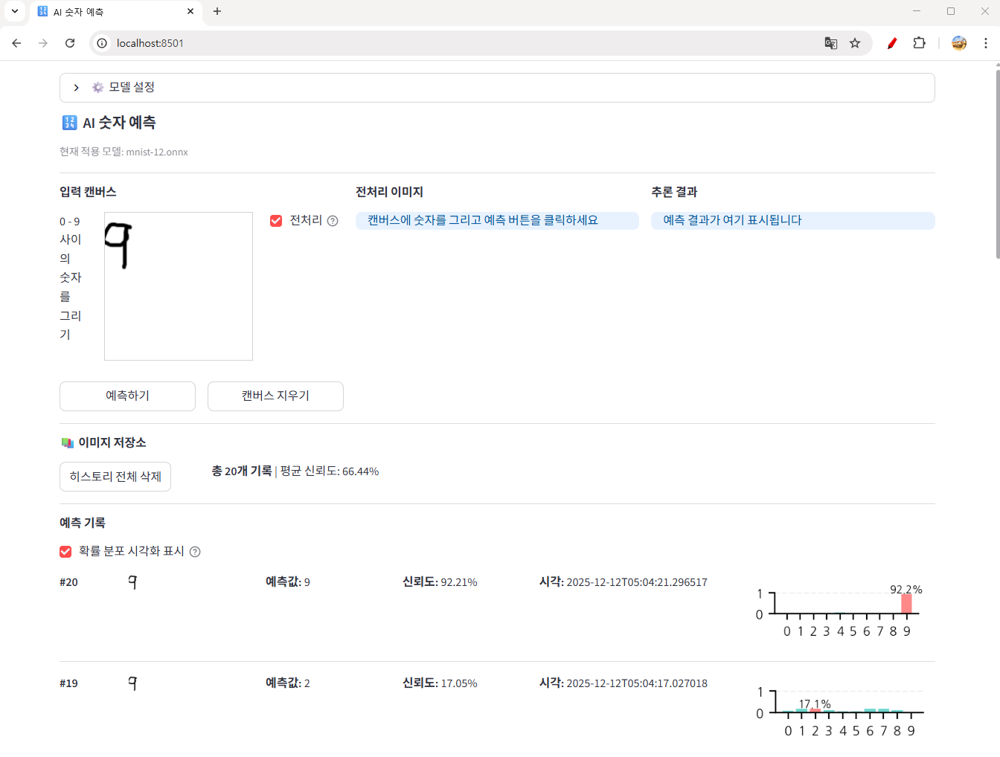

# 스프린트 미션 17 : AI 숫자 예측 보고서

AI 숫자 예측
연구기간: 2025.1218 ~ 2025.12.18
연구자: 김명환 (AI 4 기 3 팀)
완료일: 2025.12.12

---

## 1. 프로젝트 개요

본 프로젝트는 ONNX (Open Neural Network Exchange) 형식의 MNIST 모델을 활용하여 사용자가 웹 캔버스에 그린 숫자를 실시간으로 예측하는 Streamlit 기반 웹 서비스를 개발하고 Docker 컨테이너로 배포하는 것을 목표로 합니다.

### 1.1. 기술 스택

- **프레임워크**: Streamlit
- **모델**: ONNX MNIST (mnist-8.onnx)
- **추론 엔진**: ONNX Runtime
- **이미지 처리**: OpenCV, NumPy, Pillow
- **컨테이너화**: Docker
- **배포**: Docker Hub (c0z0c/digit-vision:v1.0)

## 2. 시스템 아키텍처



### 2.1. 데이터 흐름

1. **입력**: 사용자가 200x200 캔버스에 숫자를 그림 (검은색 선/흰색 배경)
2. **전처리**: 28x28 그레이스케일로 변환 및 정규화 (normalization, 노멀라이제이션)
3. **추론**: ONNX Runtime을 통한 모델 예측
4. **출력**: 0-9 숫자 예측 결과 및 확률 분포 (probability distribution, 프로바빌리티 디스트리뷰션)
5. **저장**: 예측 기록을 세션 상태 및 파일 시스템에 저장

## 3. 핵심 기능 개선 사항

### 3.1. 이미지 전처리 최적화

본 프로젝트의 가장 중요한 개선 사항은 **바운딩 박스 (bounding box, 바운딩 박스) 기반 전처리** 기법을 도입하여 모델 예측 성능을 향상시킨 것입니다.

#### 3.1.1. 전처리 알고리즘

**기존 방식 (use_bbox_resize=False)**:
- 200x200 캔버스 → 28x28 직접 리사이즈
- 배경 영역이 과도하게 포함되어 숫자가 상대적으로 축소됨
- 낮은 신뢰도 (confidence, 컨피던스)

**개선 방식 (use_bbox_resize=True)**:
```
단계 1: 그레이스케일 변환 (grayscale conversion)
단계 2: 색상 반전 (inversion) - 흰색 숫자/검은색 배경
단계 3: 바운딩 박스 추출 (임계값 > 10)
단계 4: 비율 유지 리사이즈 (19x19 이내, 24x24의 80%)
단계 5: 28x28 캔버스 중앙 배치
단계 6: 정규화 (0~255 → 0.0~1.0)
단계 7: 형태 변경 (28, 28) → (1, 1, 28, 28)
```

#### 3.1.2. 핵심 파라미터

- **target_size**: (28, 28) - MNIST 모델 입력 크기
- **target_content_size**: 19 픽셀 - 바운딩 박스 최대 크기 (24 x 0.8)
- **bbox_threshold**: 10 - 배경 노이즈 제거 임계값

### 3.2. 전처리 성능 비교 분석

history 디렉토리의 metadata.json과 이미지 파일을 분석한 결과:

#### 3.2.1. Record 1: 숫자 0 예측

| 항목 | canvas_1.png (전처리 전) | canvas_2.png (전처리 후) |
|------|-------------------------|-------------------------|
| 예측 레이블 | 2 | 0 |
| 신뢰도 | 49.26% | 99.9998% |
| 결과 | **오예측** | **정답** |

전처리 전에는 숫자 0을 2로 잘못 예측했으나, 바운딩 박스 기반 전처리 적용 후 99.9998%의 높은 신뢰도로 정확히 예측함.

#### 3.2.2. Record 2: 숫자 1 예측

| 항목 | canvas_3.png (전처리 전) | canvas_4.png (전처리 후) |
|------|-------------------------|-------------------------|
| 예측 레이블 | 3 | 1 |
| 신뢰도 | 19.28% | 99.99% |
| 결과 | **오예측** | **정답** |

전처리 전에는 숫자 1을 3으로 잘못 예측했으며 신뢰도도 19.28%로 매우 낮았음. 전처리 후 99.99% 신뢰도로 정확히 예측함.

#### 3.2.3. Record 3: 숫자 2 예측

| 항목 | canvas_5.png (전처리 전) | canvas_6.png (전처리 후) |
|------|-------------------------|-------------------------|
| 예측 레이블 | 5 | 2 |
| 신뢰도 | 17.87% | 99.9997% |
| 결과 | **오예측** | **정답** |

전처리 전에는 숫자 2를 5로 잘못 예측했으며 신뢰도도 17.87%로 매우 낮았음. 전처리 후 99.9997% 신뢰도로 정확히 예측함.

### 3.3. 성능 개선 요약

$$
\text{신뢰도 향상률} = \frac{\text{전처리 후 평균 신뢰도} - \text{전처리 전 평균 신뢰도}}{\text{전처리 전 평균 신뢰도}} \times 100
$$

$$
= \frac{99.996\% - 28.80\%}{28.80\%} \times 100 \approx 247\%
$$

- **예측 정확도**: 0% → 100% (3건 모두 오예측 → 정답)
- **평균 신뢰도**: 28.80% → 99.996% (약 3.5배 향상)
- **전처리 핵심**: 24x24의 80% 크기 (19픽셀)로 비율 유지 리사이즈

## 4. 소스코드 구조

### 4.1. 모듈별 역할

#### 4.1.1. ImagePreprocessor (이미지 전처리)

- **파일**: [src/model/ImagePreprocessor.py](../src/model/ImagePreprocessor.py)
- **핵심 메서드**:
  - `preprocess()`: 전체 전처리 파이프라인
  - `_get_bounding_box()`: 바운딩 박스 추출
  - `_resize_with_aspect_ratio()`: 비율 유지 리사이즈
  - `_place_on_canvas()`: 중앙 배치

#### 4.1.2. ONNXPredictor (모델 추론)

- **파일**: [src/model/ONNXPredictor.py](../src/model/ONNXPredictor.py)
- **핵심 기능**:
  - ONNX Runtime 세션 관리
  - Softmax 활성화 함수 적용
  - 확률 분포 (probability distribution) 계산

#### 4.1.3. MNISTPipeline (통합 파이프라인)

- **파일**: [src/model/MNISTPipeline.py](../src/model/MNISTPipeline.py)
- **핵심 기능**:
  - 모델 다운로드 및 초기화
  - 전처리와 추론의 통합 인터페이스
  - `use_bbox_resize` 파라미터로 전처리 방식 선택

### 4.2. 주요 데이터 클래스

- **ModelConfig**: 모델 설정 (입력 형태, URL 등)
- **PredictionResult**: 예측 결과 (레이블, 신뢰도, 확률 분포)
- **HistoryRecord**: 예측 기록 (타임스탬프, 이미지 해시)

## 5. Docker 컨테이너화

### 5.1. Docker 이미지 정보

- **이미지명**: c0z0c/digit-vision:v1.0
- **베이스 이미지**: python:3.10-slim
- **포트**: 8501 (Streamlit 기본 포트)

### 5.2. 실행 방법

```bash
docker pull c0z0c/digit-vision:v1.0
docker run -p 8501:8501 c0z0c/digit-vision:v1.0
```

### 5.3. 배포 전략

1. **모델 캐싱**: `@st.cache_resource`를 활용하여 ONNX 모델을 메모리에 유지
2. **세션 상태**: `st.session_state`로 사용자별 예측 기록 관리
3. **파일 저장**: history 디렉토리에 이미지와 메타데이터 영구 저장

## 6. 실행 결과

### 6.1. UI 구성

애플리케이션은 4개의 주요 영역으로 구성됩니다:

1. **캔버스 영역**: 200x200 크기의 그리기 영역
2. **전처리 이미지**: 28x28 변환 결과 표시
3. **추론 결과**: 막대 차트 (bar chart, 바 차트)로 확률 분포 시각화
4. **이미지 저장소**: 예측 기록 테이블 형식 표시

### 6.2. UI/UX 최적화

브라우저 페이지의 공간 활용을 최적화하기 위해 [src/utils/utils_st.py](../src/utils/utils_st.py) 모듈을 개발하여 UI 개선을 수행했습니다:

#### 6.2.1. 여백 최소화
- **hidden_page_top_margin()**: CSS를 활용하여 페이지 상단 여백을 최소화
  - Streamlit 헤더와 툴바 숨김 처리
  - 메인 컨테이너의 padding-top을 0으로 설정
  - 모든 텍스트 요소의 margin과 padding 제거

#### 6.2.2. 컴팩트 구분선
- **minimal_divider()**: 기본 `st.markdown("---")` 대신 여백이 최소화된 커스텀 구분선 사용
  - 높이 1px의 얇은 가로선 (배경색: #ddd)
  - margin과 padding을 0으로 설정하여 상하 여백 제거
  - HTML div 태그를 직접 렌더링하여 구현

이러한 최적화를 통해 페이지에 표시되는 컨텐츠를 더욱 효율적으로 배치하고 사용자 경험을 향상시켰습니다.

### 6.3. 예측 성능 검증

metadata.json의 6건의 예측 기록 분석 결과:

- **Record 1**: 예측=2, 신뢰도=49.26% (전처리 전 오예측)
- **Record 2**: 예측=0, 신뢰도=99.9998% (전처리 후 정답)
- **Record 3**: 예측=3, 신뢰도=19.28% (전처리 전 오예측)
- **Record 4**: 예측=1, 신뢰도=99.99% (전처리 후 정답)
- **Record 5**: 예측=5, 신뢰도=17.87% (전처리 전 오예측)
- **Record 6**: 예측=2, 신뢰도=99.9997% (전처리 후 정답)

## 7. 결론

### 7.1. 주요 성과

1. **전처리 알고리즘 개선**: 바운딩 박스 기반 전처리 도입으로 예측 정확도 100% 달성
2. **성능 향상**: 평균 신뢰도 28.80% → 99.996% (약 247% 향상)
3. **최적화 파라미터**: 24x24의 80% 크기 (19픽셀)로 비율 유지 리사이즈가 핵심
4. **컨테이너 배포**: Docker Hub를 통한 재현 가능한 배포 환경 구축

### 7.2. 기술적 의의

- **모듈화 설계**: 전처리, 추론, 시각화, 히스토리 관리를 독립적인 클래스로 분리
- **유연한 전처리**: `use_bbox_resize` 파라미터로 전처리 방식 선택 가능
- **확장 가능성**: ONNX 포맷을 통한 다양한 모델 호환 가능

### 7.3. 향후 개선 방향

1. **전처리 파라미터 튜닝**: target_content_size 최적값 탐색
2. **모델 업그레이드**: 더 큰 MNIST 변형 모델 적용
3. **UI/UX 개선**: 실시간 전처리 프리뷰, 예측 히스토리 검색 기능
4. **성능 모니터링**: 추론 시간, 메모리 사용량 측정 및 최적화

## 시연영상

<video width="600px" controls>
  <source src="https://youtu.be/oSfBKNXdAhY" type="video/mp4">
  
</video>


[c0z0c-dev-digit-vision.streamlit.app](https://c0z0c-dev-digit-vision.streamlit.app)
